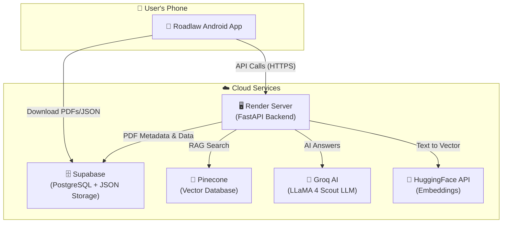
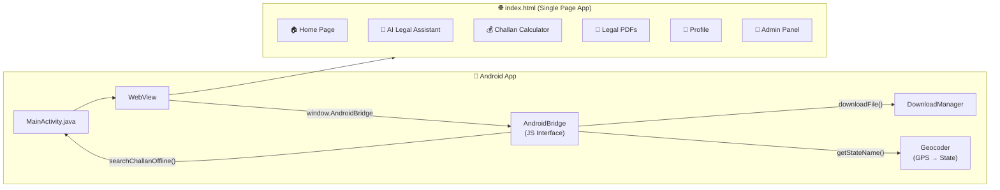
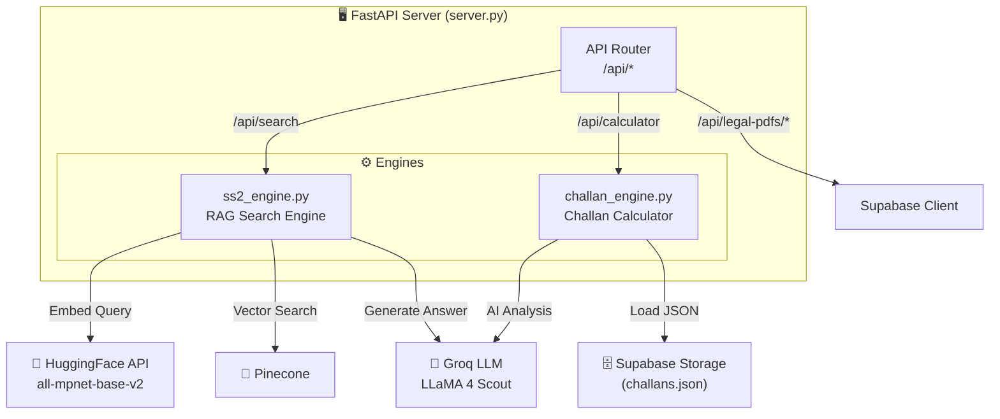
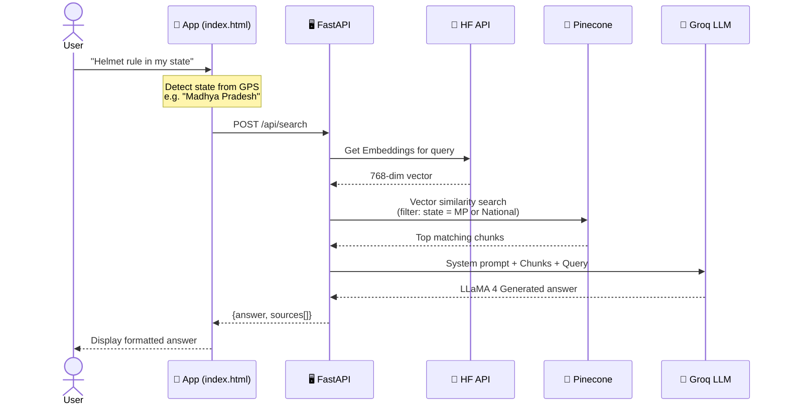
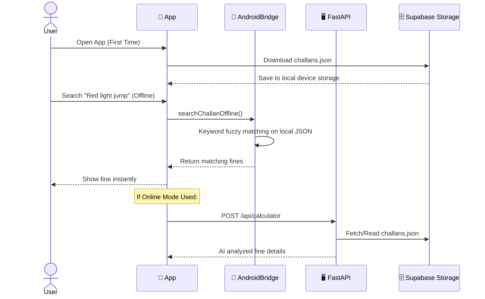
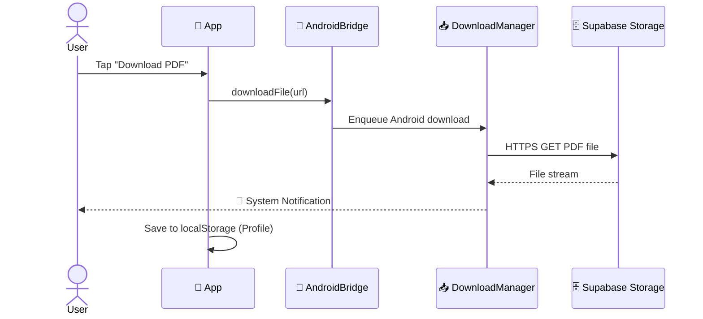
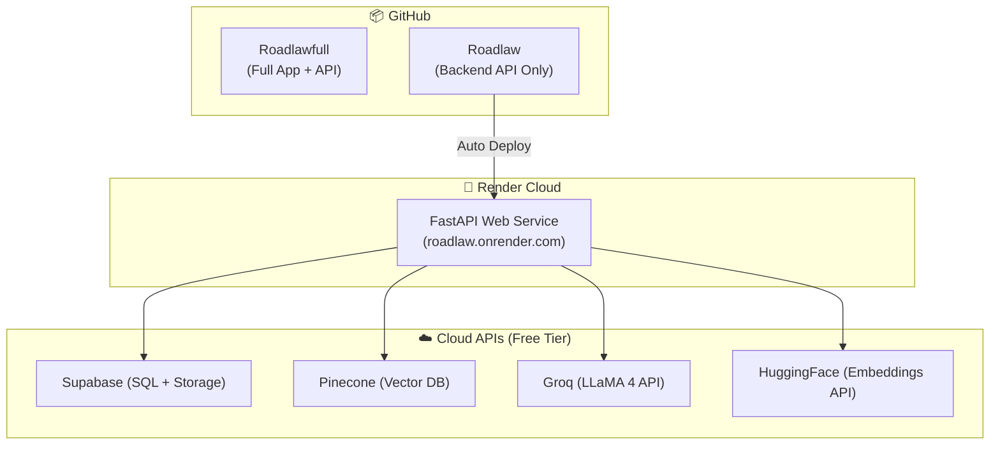

# 🏗️ Roadlaw — Complete Project Architecture

## 1. High-Level System Overview



---

## 2. Android App Architecture



### App Pages (Single Page Application)

| Page | Description | Key Features |
|------|-------------|-------------|
| 🏠 **Home** | Landing page with quick actions | Quick chips, GPS location display |
| 🤖 **AI Assistant** | Chat with AI | RAG-powered, state-specific answers |
| 💰 **Challan Calculator** | Fine estimation tool | Online + Offline mode, keyword matching |
| 📄 **Legal PDFs** | State law documents | Browse, search, download PDFs |
| 👤 **Profile** | User settings & downloads | Downloaded PDFs list, dark mode |
| 🔧 **Admin** | Document & data management | Upload PDFs to Pinecone, manage JSON |

### Key Files

| File | Path | Purpose |
|------|------|---------|
| `MainActivity.java` | `app/src/main/java/.../` | Android WebView + JS Bridge |
| `index.html` | `app/src/main/assets/` | Full SPA UI (~2480 lines) |
| `AndroidManifest.xml`| `app/src/main/` | Permissions & app config |

---

## 3. Backend Architecture



### API Endpoints

| Method | Endpoint | Description |
|--------|----------|-------------|
| `GET` | `/api/health` | Server health check |
| `POST` | `/api/search` | AI-powered legal search (RAG) |
| `POST` | `/api/calculator` | Challan fine calculator |
| `GET` | `/api/legal-pdfs/search?q=` | Search legal PDFs in Supabase |
| `GET` | `/api/legal-pdfs/list` | List all legal PDFs |
| `POST` | `/api/legal-pdfs/upload` | Upload PDF to Supabase Storage |
| `GET` | `/api/sync-challans` | Download challans.json |
| `POST` | `/api/admin/ingest` | Process PDF & upload vectors to Pinecone |

### Backend Files

| File | Purpose |
|------|---------|
| `server.py` | Main FastAPI server — API endpoints |
| `ss2_engine.py` | RAG engine — HF API embeddings, Pinecone, Groq LLM |
| `challan_engine.py` | Challan engine — Supabase JSON parsing, fine logic |
| `requirements.txt` | Python dependencies (API-only, no heavy torch) |
| `.env` | Environment variables (Pinecone, Groq, Supabase, HF) |

---

## 4. Data Flow Diagrams

### 4.1 AI Legal Search Flow



### 4.2 Challan Calculator Flow (Online & Offline)



### 4.3 PDF Download Flow



---

## 5. Database Schema & Storage

### 5.1 Supabase SQL (Metadata)
```sql
CREATE TABLE legal_pdfs (
    id SERIAL PRIMARY KEY,
    filename TEXT NOT NULL,
    display_name TEXT,
    category TEXT DEFAULT 'State Law',
    state_name TEXT DEFAULT 'ALL',
    country TEXT DEFAULT 'India',
    file_url TEXT,
    created_at TIMESTAMPTZ DEFAULT NOW()
);
```

### 5.2 Supabase Storage Buckets
| Bucket Name | Content | Access |
|-------------|---------|--------|
| `legal-pdfs` | Motor Vehicle Rules PDF files | Public |
| `app-data` | `challans.json` for offline syncing | Public |

### 5.3 Pinecone (Vector DB)
- **Index:** `roadlaw-legal`
- **Dimension:** 768 (`all-mpnet-base-v2`)
- **Metric:** Cosine Similarity
- **Metadata stored per vector:** `country`, `state_name`, `source_pdf`, `page_num`

---

## 6. Deployment Architecture



### Environment Variables (.env)
| Key | Purpose |
|-----|---------|
| `GROQ_API_KEY` | For LLaMA 4 Scout LLM text generation |
| `PINECONE_API_KEY` | For RAG vector similarity search |
| `SUPABASE_URL` | For database and storage connection |
| `SUPABASE_SERVICE_KEY` | For admin access to Supabase |
| `HF_API_KEY` | For HuggingFace Embeddings (saves Render RAM) |

---

## 7. Tech Stack Overview

- **Frontend:** HTML, CSS, JS, TailwindCSS within Android WebView
- **Mobile Native:** Java, Android SDK (DownloadManager, Geocoder)
- **Backend Framework:** Python 3.11, FastAPI, Uvicorn
- **AI/RAG:** LangChain, HuggingFace API (`all-mpnet-base-v2`)
- **LLM Model:** Groq API (`meta-llama/llama-4-scout-17b-16e-instruct`)
- **Databases:** Supabase (PostgreSQL), Pinecone (Vectors)
- **Hosting:** Render (Cloud Platform)
